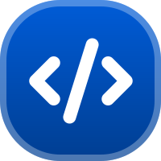

<div align="center">



</div>

# 웹 코더

> 이 저장소는 **보관(archive) 상태**입니다.
> 백준(BOJ) 서비스 종료 공지에 따라, 이 확장 프로그램은 더 이상 제공되거나 유지보수되지 않습니다.
> 현재 저장소는 기존 구현을 보존하고 참고하기 위한 용도로만 남겨 두었습니다.

백준(BOJ) 제출 페이지를 더 편하게 쓰기 위해 만들었던 **Chrome 확장 프로젝트**입니다.

기존 제출 폼을 그대로 두는 대신, 브라우저 안에서 **문제 확인 → 코드 작성 → 테스트 실행 → 제출**까지 한 화면에서 끝낼 수 있도록 재구성했던 프로젝트입니다.

포트폴리오 관점에서는 **실제 서비스 UI 재구성**, **Chrome Extension(MV3)**, **로컬 WebAssembly 실행 환경**, **기존 웹서비스와의 폼 연동**을 함께 보여 줄 수 있는 프로젝트입니다.

## 현재 상태

- 백준 서비스 종료에 따라 이 확장 프로그램은 더 이상 사용할 수 없는 상태입니다.
- 신규 기능 개발, 배포, 사용자 지원은 진행하지 않습니다.
- 저장소는 아카이브 및 구현 참고용으로만 유지합니다.

## 프로젝트 개요

- **프로젝트 목적**: BOJ 제출 페이지의 반복적인 문제풀이 흐름을 더 빠르고 편하게 만드는 것
- **핵심 사용자 가치**: 브라우저를 벗어나지 않고 문제 읽기, 코드 작성, 테스트, 제출을 한 번에 처리
- **현재 지원 언어**: C++17, Python 3
- **실행 방식**: 두 언어 모두 확장 프로그램 내부의 로컬 WebAssembly 런타임에서 실행

## 주요 기능

- **커스텀 제출 화면 렌더링**: `/submit` 페이지에 진입하면 기존 BOJ 제출 폼을 감싸는 분할형 UI를 렌더링합니다.
- **문제/코드/결과 동시 확인**: 문제 본문, 에디터, 테스트 결과를 한 화면에서 볼 수 있습니다.
- **로컬 실행 지원**: C++17과 Python 3은 외부 실행 서버 없이 브라우저 안에서 테스트할 수 있습니다.
- **기존 제출 흐름 유지**: BOJ 원본 form 데이터를 활용해 실제 제출 흐름은 깨지지 않도록 유지합니다.
- **상태 저장**: 코드, 기본 언어, 에디터 테마, 커스텀 테스트 케이스를 `chrome.storage.local`에 저장합니다.

## 기술적으로 보여 줄 수 있는 포인트

### 1) 기존 서비스 위에 커스텀 인터페이스를 얹는 구조

웹 코더는 BOJ의 `/submit` 페이지에 content script를 주입하고, 기존 DOM과 제출 폼을 활용해 별도의 작업 화면을 구성합니다.

즉, 새 서비스를 처음부터 만드는 것이 아니라 **이미 운영 중인 서비스의 흐름을 해치지 않고 UX를 개선하는 방식**에 가깝습니다.

### 2) 브라우저 안에서의 로컬 코드 실행

C++17과 Python 3은 확장 프로그램 내부의 WebAssembly 런타임으로 실행합니다.

이 구조 덕분에 테스트 시 코드와 입력값이 외부 실행 서버로 전달되지 않으며, 사용자 입장에서는 더 즉각적인 실행 경험을 제공합니다.

### 3) BOJ 제출 흐름과의 안전한 연동

제출 단계에서는 원본 hidden field와 제출 데이터 구조를 최대한 보존한 채 BOJ로 요청을 보냅니다.

그래서 화면은 커스텀 UI지만, 실제 제출은 BOJ가 기대하는 구조를 따르도록 설계했습니다.

## 프로젝트 구조

```text
web-coder/
├─ src/
│  ├─ main.ts                    # content script 진입점
│  ├─ background.ts              # 실행 요청 처리
│  ├─ manifest.ts                # Chrome MV3 매니페스트
│  ├─ popup.tsx                  # 확장 팝업 UI
│  ├─ baekjoon/                  # BOJ 전용 화면, API, 저장, 제출 로직
│  └─ common/                    # 공통 타입, 유틸, 프레젠테이션, WASM 실행 유틸
├─ public/                       # 아이콘, 정적 리소스, WASM 에셋
├─ scripts/                      # 빌드 보조 스크립트
├─ README.md
└─ LICENSE.md
```

## 동작 흐름

### 1) 페이지 주입

1. content script가 BOJ 도메인에서 동작합니다.
2. 현재 경로가 `/submit`인지 확인합니다.
3. 기존 제출 폼을 기반으로 커스텀 루트 UI를 렌더링합니다.

### 2) 실행

1. 에디터 코드와 입력값을 모아 background에 실행 요청을 보냅니다.
2. background가 언어에 맞는 로컬 WebAssembly 런타임을 실행합니다.
3. 결과를 테스트 패널에 표시합니다.

### 3) 제출

1. 현재 코드, 언어, 공개 설정 등을 조합합니다.
2. BOJ 제출 형식에 맞는 요청을 생성합니다.
3. BOJ에 실제 제출을 진행합니다.

## 기술 스택

- **Frontend**: React 18, TypeScript
- **Build Tooling**: Vite, CRXJS
- **Extension Platform**: Chrome Extension Manifest V3
- **Code Execution**: WebAssembly, WASI
- **HTTP / DOM Integration**: Axios, content script 기반 페이지 연동
- **Documentation**: VitePress

## 지원 언어

| BOJ 언어 ID | 언어 | 내부 키 | 실행 방식 |
| --- | --- | --- | --- |
| `84` | C++17 | `cpp17` | 로컬 WebAssembly |
| `28` | Python 3 | `python3` | 로컬 WebAssembly |

## 로컬 실행 특성

- 실행 시 코드와 입력값은 외부 실행 서버로 전송되지 않습니다.
- 실행 결과는 extension background 흐름에서 처리됩니다.
- 테스트 중심의 빠른 반복 작업에 맞춘 구조입니다.

## 로컬 빌드

```bash
npm install
npm run build
```

아카이브 검토 또는 개인적인 참고 목적으로만 빌드할 수 있습니다.

빌드 후 Chrome에서 `chrome://extensions`로 들어가 **개발자 모드**를 켠 뒤, `dist`를 압축해제된 확장 프로그램으로 로드할 수 있습니다. 다만 BOJ 서비스 종료 이후에는 원래 목적대로 사용할 수 없습니다.

## 문서

- 문서 사이트: <https://web-coder.andongmin.com>
- 문서 프로젝트는 이제 이 저장소 밖에서 별도로 관리합니다.

## 라이선스

이 저장소는 개인 커스텀 빌드 기준의 라이선스를 사용합니다.

자세한 내용은 [LICENSE.md](./LICENSE.md)를 참고해 주세요.
